# Chapter 1: Scale from Zero to Millions of Users

## Introduction
Scaling a system to support millions of users is a complex, iterative journey requiring refinement and optimization. This chapter outlines how to begin with a single server setup and scale the architecture step by step to handle millions of users.

---

## Section 1: Single Server Setup
Initially, all components (web app, database, cache) run on a single server. 

   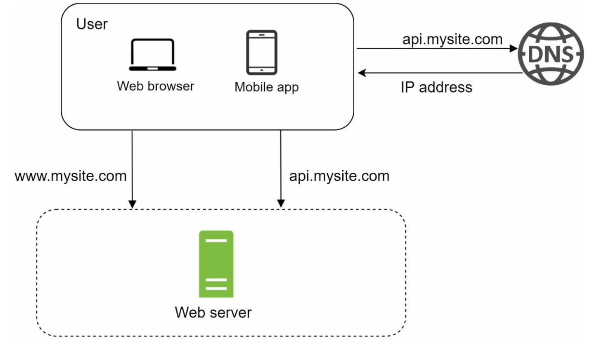

### Request Flow
1. Users access the application via domain names (e.g., `api.mysite.com`), resolved to IP addresses using DNS.
2. IP address of the web-server is returned to the browser or mobile app.
3. HTTP requests are sent to the web server, which returns HTML or JSON responses.

### Traffic Sources
1. **Web Applications:** Use server-side languages (e.g., Python, Java) for business logic and client-side languages (e.g., JavaScript, HTML) for presentation.
2. **Mobile Applications:** Communicate with the web server using HTTP and JSON for lightweight data exchange.

---

## Section 2: Database Separation
As the user base grows, the database is moved to a dedicated server to allow independent scaling of web and database tiers.

   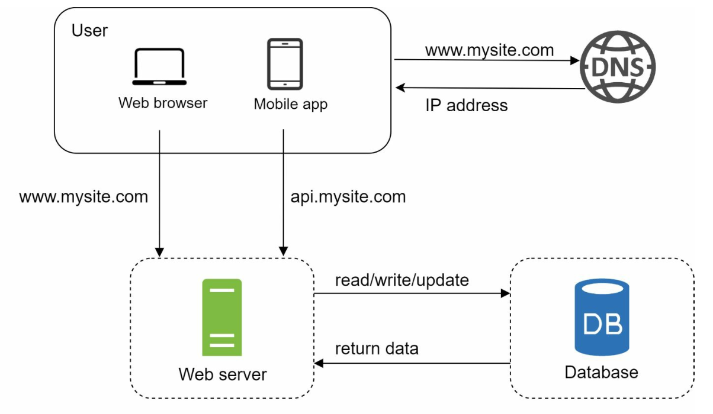

### Database Choices

1. **Relational Databases (SQL):** Structured data stored in tables. Examples: MySQL, PostgreSQL.
2. **Non-Relational Databases (NoSQL):** Suitable for unstructured data or low-latency requirements. Categories include:
   - Key-Value Stores
   - Graph Databases
   - Column Stores
   - Document Stores

- Non-relational databases might be the right choice if:
   - application requires super-low latency.
   - data is unstructured, or  there is no relational data.
   - only need to serialize and deserialize data (JSON, XML, YAML, etc.).
   - need to store a massive amount of data.

---

## Section 3: Vertical vs Horizontal Scaling
### Vertical Scaling
- Adds more resources (CPU, RAM) to existing servers.
- Limited by hardware constraints and lacks redundancy.

### Horizontal Scaling
- Adds more servers to the pool, making it more suitable for large-scale systems.
- A load balancer is used to handle the request routing between the servers.
---

## Section 4: Load Balancer

   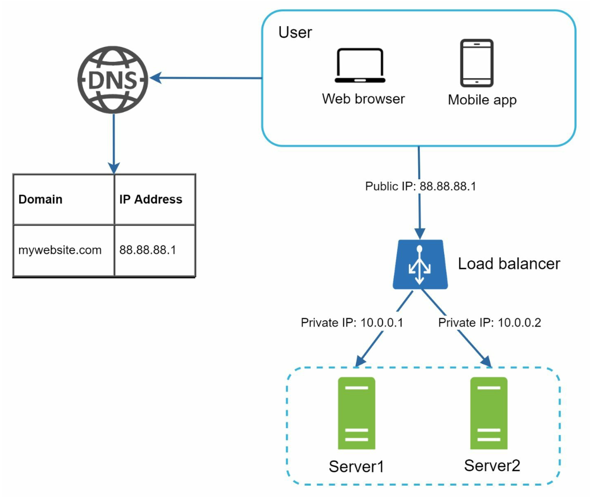

A **load balancer** distributes traffic among multiple servers. Benefits include:
1. Redundancy: If a server goes offline, traffic is rerouted.
   -  If server 1 goes offline, all the traffic will be routed to server 2.
2. Scalability: Easily add servers to handle traffic spikes.
   -  If the website traffic grows rapidly, subsequent servers can be added to handle the additional traffic.

---

## Section 5: Database Replication

   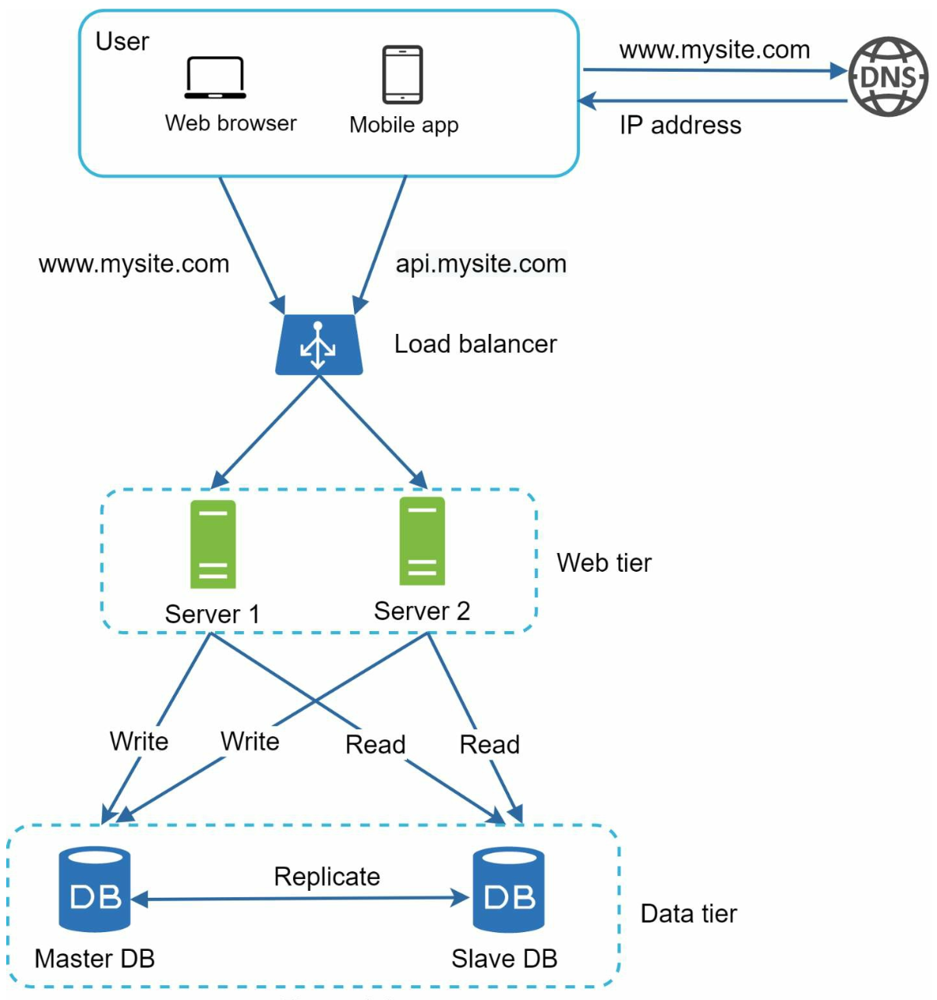

### Master-Slave Model
- **Master Database:** Handles write operations.
   - All the data-modifying commands like insert, delete, or update must be sent to the master database.
- **Slave Databases:** Handle read operations, improving performance and reliability.
   - Since the ratio of reads to writes is higher is most applications; thus, the number of slave
databases in a system is usually larger than the number of master databases.

### Benefits
1. Improved performance through parallel read operations.
2. High availability and data reliability through redundancy.

### Failure Handling
- If only one slave database is available and it goes offline, read operations will be directed
to the master database temporarily.
- In case multiple slave databases are available, read operations are
redirected to other healthy slave databases and a new server will replace the old one. 
-  If the master database goes offline, a slave database will be promoted to be the new
master.
- In production system the chosen slave database might not be up to date, hence data needs to be updated by running data
recovery scripts (methods like multi-masters and circular replication could help).

---

## Section 6: Caching
A **cache** stores frequently accessed data in memory to reduce database load. The cache tier is a temporary data store layer, much faster than the database. 

   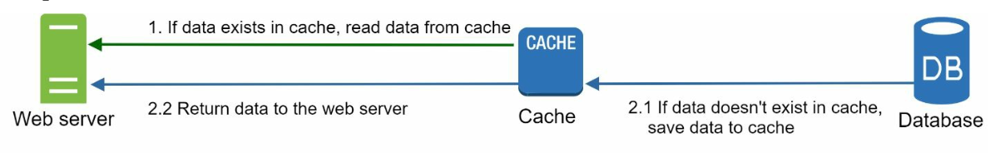

### Caching considerations
1. **Use case**: Consider using cache when data is read frequently but modified infrequently.
2. **Expiration Policies:** Once cached data is expired, it is removed from the cache. When there is no expiration policy, cached
data will be stored in the memory permanently.
3. **Consistency:** This means keeping the data store and the cache in sync. Inconsistency
can happen because data-modifying operations on the data store and cache are not in a single transaction. 
4. **Mitigating failures**: A single cache server represents a potential single point of failure, multiple
cache servers across different data centers are recommended to avoid SPOF.
5. **Eviction Policies:**: Once the cache is full, items need to be evicted to free up memory. LRU is the most popular cache eviction policy.

---

## Section 7: Content Delivery Network (CDN)
A **CDN** improves load times by caching static content (images, CSS, JavaScript) on geographically distributed servers.

   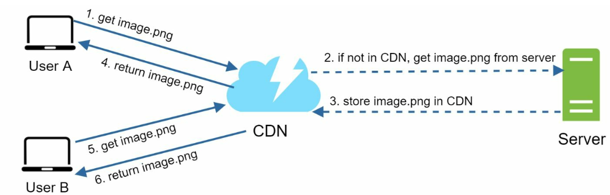

### Workflow
1. User requests content from the nearest CDN server.
2. If unavailable, content is fetched from the origin server and cached.

### CDN considerations
1. **Cost:** CDNs are run by third-party providers which charge for data transfers in and out of the CDN.
2. **Cache Expiry:** The cache expiry time should neither be too long nor too short.
3. **CDN fallback:** If there is a temporary CDN outage, clients should be able to detect the problem
and request resources from the origin.
4. **Invalidating files:** If files are updated the cache should be invalidated to point to the updated files.

---

## Section 8: Stateless Web Tier
By moving session data to a shared datastore, web servers become stateless. This allows:
1. Easier horizontal scaling.
2. Auto-scaling based on traffic.

   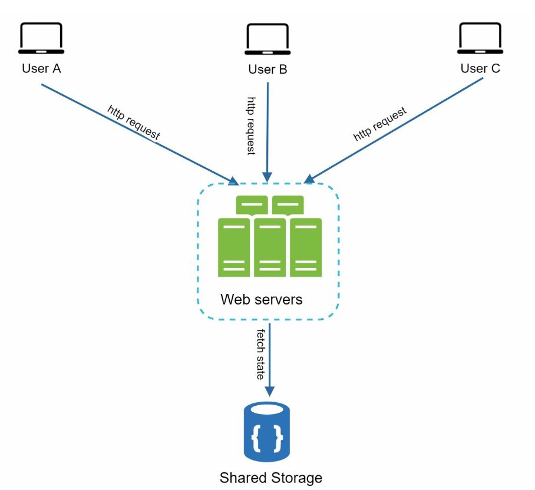

---

## Section 9: Multi-Data Center Setup
Deploying across multiple data centers improves availability and reduces latency. Strategies include:

   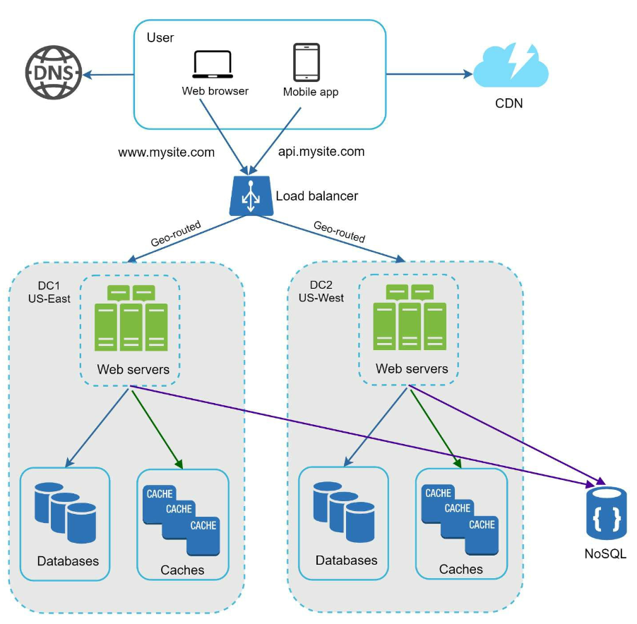

1. **GeoDNS Routing:** Direct users to the nearest data center.
2. **Data Replication:** Synchronize data across centers to prevent inconsistencies.

### Key considerations
- **Traffic redirection:** Effective tools are needed to direct traffic to the correct data center.
- **Data synchronization:** A common strategy is to replicate data across multiple data centers. 
- **Test and deployment:**  Automated deployment tools are vital to keep services consistent through all the data centers.

---

## Section 10: Message Queue
A **message queue** is a durable component, stored in memory, that supports asynchronous
communication. It serves as a buffer and distributes asynchronous requests.

   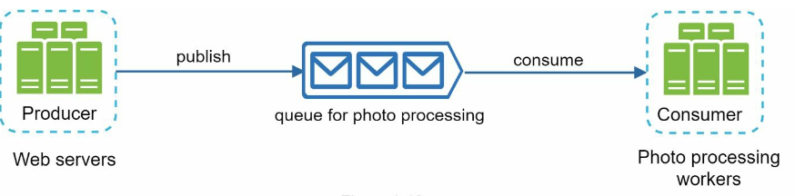

- Input services, called producers/publishers, create messages, and publish them to a message queue.
- Other services called consumers/subscribers, connect to the queue, and perform actions defined by the messages.

---

## Section 11: Logging, Metrics, and Automation

   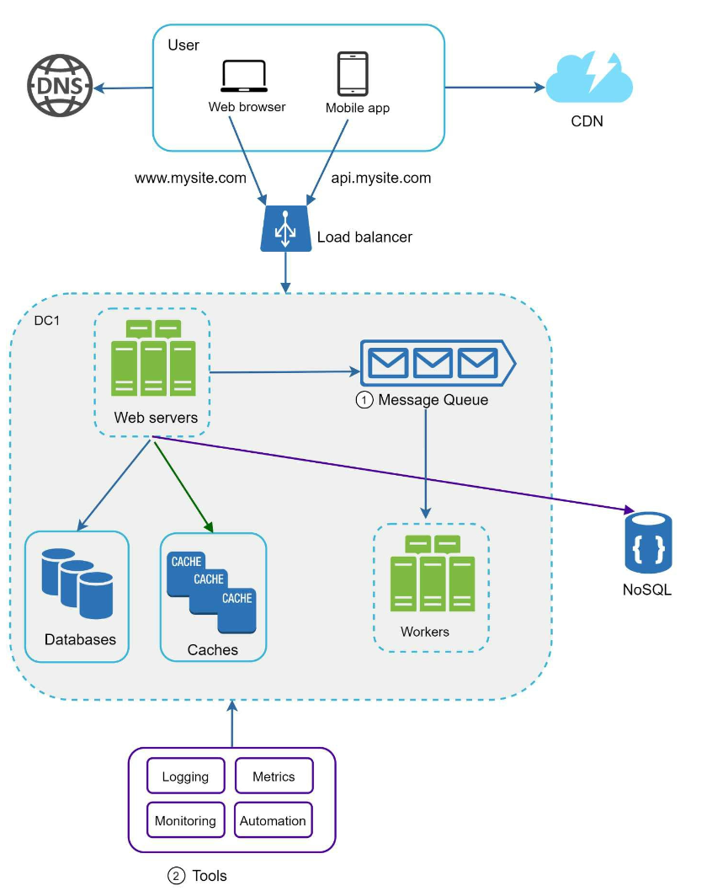

### Importance
1. **Logging:** Tracks errors and system health.
2. **Metrics:** Provides insights into performance and user activity.
3. **Automation:** Streamlines testing, deployment, and scaling.

---

## Section 12: Database Scaling
### Vertical Scaling
- Adds hardware resources but has physical and cost limitations.
- Has multiple drawbacks:
   -  Greater risk of single point of failures.
   -  Overall cost of vertical scaling is high

### Horizontal Scaling (Sharding)

   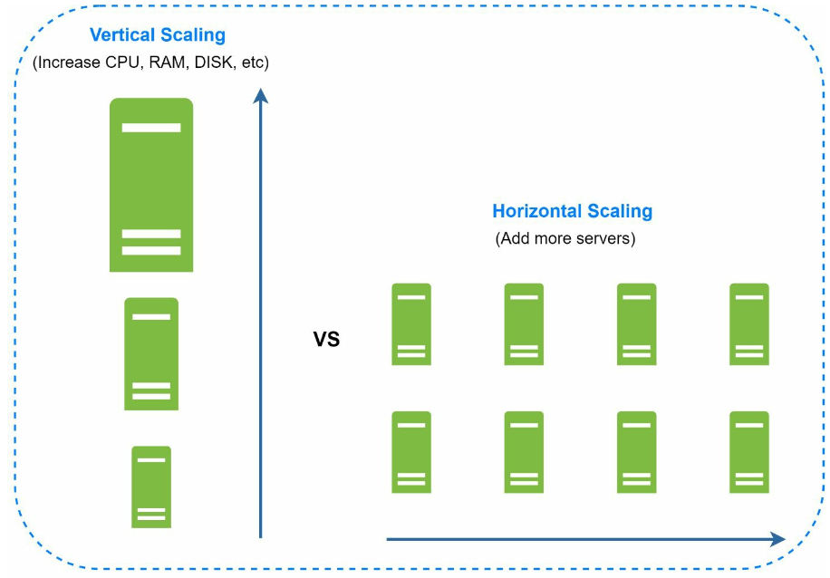

- Divides data across multiple shards using keys (e.g., `user_id`).
   - Sharding separates large databases into smaller, more easily managed parts called shards.
   - Each shard shares the same schema, though the actual data on each shard is unique to the shard.
-  Sharding key is critical when implementing a sharding strategy. When choosing a sharding key it is important to choose a key that can evenly distribute data.

#### Challenges 
1. **Resharding data:** Resharding data is needed when:
   - Single shard could no longer hold more data due to rapid growth. 
   - Certain shards might experience shard exhaustion faster than others due to uneven data distribution.
   - Consistent Hashing is used to overcome these problems

2. **Celebrity problem:**  Excessive access to a specific shard could cause server overload.
   - To solve this problem, we may need to allocate a shard for each celebrity.

3. **Join and de-normalization:** Once a database has been sharded across multiple servers, it is hard to perform join operations across database shards.
   -  A common workaround is to de-normalize the database so that queries can be performed in a single table.

---

## Conclusion
### Key Takeaways
1. Keep the web tier stateless.
2. Build redundancy at every tier.
3. Use caching and CDNs to optimize performance.
4. Scale the data tier with sharding.
5. Decouple components for flexibility.

This chapter provides a solid foundation for building scalable systems that can handle millions of users.

