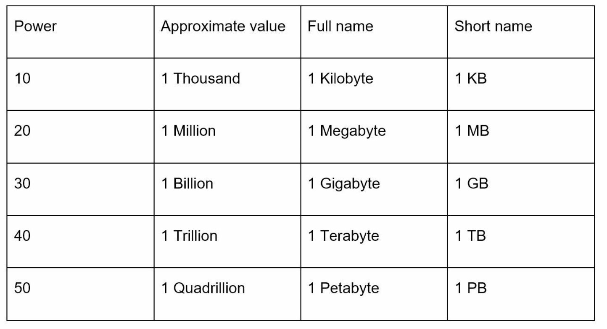

# Chapter 2: Back-of-the-Envelope Estimation

## Introduction
Back-of-the-envelope estimation is a crucial skill in system design interviews. It involves making quick, rough calculations to assess system capacity or performance. According to Jeff Dean, Google Senior Fellow, these estimates help evaluate whether designs meet requirements through thought experiments and common performance benchmarks.

This chapter covers key concepts, methodologies, and examples to build proficiency in scalability and estimation.

---

## Section 1: Key Concepts

### Power of Two
Understanding data volume in terms of powers of two is fundamental:

This knowledge helps in performing accurate storage and bandwidth calculations.

---

### Latency Numbers Every Programmer Should Know
Latency numbers represent the time taken for various operations in computing systems. These provide insights into relative performance:

| Operation                | Latency (2020) |
|--------------------------|----------------|
| L1 Cache Access          | 0.5 ns         |
| L2 Cache Access          | 7 ns           |
| Main Memory Access       | 100 ns         |
| SSD Random Read          | 150 µs         |
| HDD Random Seek          | 10 ms          |
| Round-Trip in Data Center| 500 µs         |
| Inter-Region Data Center | 150 ms         |

**Key Insights:**
- Memory is fast, disk is slow.
- Avoid disk seeks whenever possible.
- Compress data before transmitting over the internet to save bandwidth.

---

### Availability Numbers
High availability (HA) ensures minimal downtime. Availability is expressed in **nines**:
- **99% (Two Nines):** ~3.65 days/year of downtime
- **99.9% (Three Nines):** ~8.8 hours/year of downtime
- **99.99% (Four Nines):** ~52 minutes/year of downtime
- **99.999% (Five Nines):** ~5.3 minutes/year of downtime
- **99.9999% (Six Nines):** ~31.56 seconds/year of downtime

Cloud providers like Amazon, Google, and Microsoft aim for SLAs (Service Level Agreements) of **99.9% or higher**.

---

## Section 2: Example Estimation - Twitter QPS and Storage Requirements

### Assumptions
- **300 million monthly active users (MAU).**
- **50% daily active users (DAU).**
- **Average tweets/user/day:** 2.
- **10% of tweets contain media.**
- **Data retention:** 5 years.

### Estimations
1. **Query Per Second (QPS):**
   - DAU = \( 300M x 50\% = 150M \)
   - Tweets QPS = \( 150M x 2 tweets / 24 hour / 3600 seconds = ~3500 )
   - Peak QPS = \( 2 x 3500 = ~7000 \)

2. **Media Storage:**
   - **Tweet Size Components:**
     - `tweet_id`: 64 bytes
     - `text`: 140 bytes
     - `media`: 1 MB
   - **Daily Media Storage:** \( 150M x 2 x 10\% x 1MB = 30TB per day \)
   - **5-Year Storage:** \( 30TB x 365 x 5 = ~55PB \)

---

## Section 3: Tips for Effective Estimation

### 1. Rounding and Approximation
Precision is not critical; focus on the process. Simplify complex calculations using round numbers. For example:
- \( 99987 / 9.1 \) can be approximated as \( 100,000 / 10 = 10,000 \).

### 2. Write Down Assumptions
Document assumptions clearly for future reference.

### 3. Label Units
Avoid ambiguity by labeling units (e.g., `5 MB` instead of `5`).

### 4. Common Estimation Scenarios
- **QPS (Queries Per Second):** Measure traffic intensity.
- **Peak QPS:** Account for traffic spikes.
- **Storage Requirements:** Estimate total data needs.
- **Cache Requirements:** Evaluate memory requirements for caching.
- **Number of Servers:** Calculate hardware needs based on workload.

